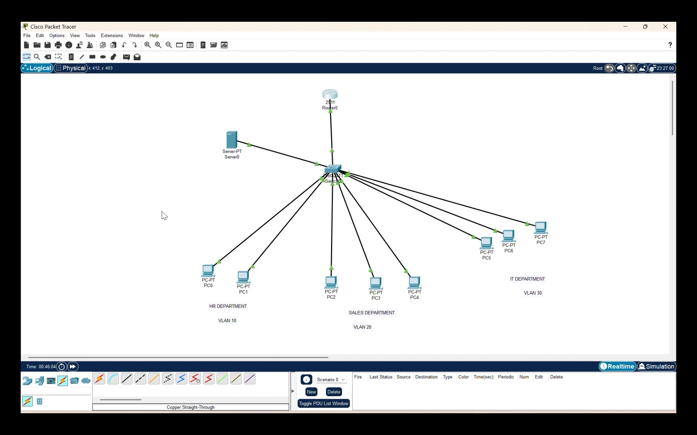

# Small Office Network Setup – A2 Technosoft Company

## 📌 Project Overview

This project involved designing and implementing a small office network for A2 Technosoft Company (Client: Onyx) using VLAN segmentation, inter-VLAN routing, DHCP configuration, and network security techniques. The network was designed to improve performance, security, and network management across departments such as HR, Sales, and IT.

---

## 👨‍💻 Role

Network Engineer

## ⏱ Duration

3 Months

## 🏢 Client

A2 Technosoft Company (Client: Onyx)

---

## 🛠️ Technologies Used

* Cisco Packet Tracer
* VLAN
* Inter-VLAN Routing
* DHCP
* Port Security
* Switch Hardening
* Routing and Switching

---

## 🧠 Network Architecture

Departments → Access Switch → Distribution Switch → Router → Internet
VLAN Segmentation for Departments
DHCP Server for Automatic IP Allocation
Inter-VLAN Routing for Department Communication

  

---

## ⚙️ Implementation Steps

1. Designed office network topology connecting multiple departments.
2. Configured VLANs for HR, Sales, and IT departments.
3. Implemented inter-VLAN routing for communication between VLANs.
4. Configured DHCP for automatic IP address allocation.
5. Implemented port security to restrict unauthorized devices.
6. Performed switch hardening by disabling unused ports.
7. Tested network connectivity and security.
8. Documented network configuration and topology.

---

## 🚀 Key Features

* VLAN based network segmentation
* Inter-VLAN routing
* Automatic IP allocation using DHCP
* Network security using port security
* Switch hardening
* Secure and efficient office network design

---

## 🎯 Outcome

Successfully designed and implemented a secure and efficient office network with VLAN segmentation, routing, DHCP automation, and improved network security.

---

## 📁 Folder Structure

Office-Network-VLAN/
│
├── README.md
├── topology/
├── screenshots/

---
## Configuration Files

Full configuration for router and switch is available in:
configs/config.txt
